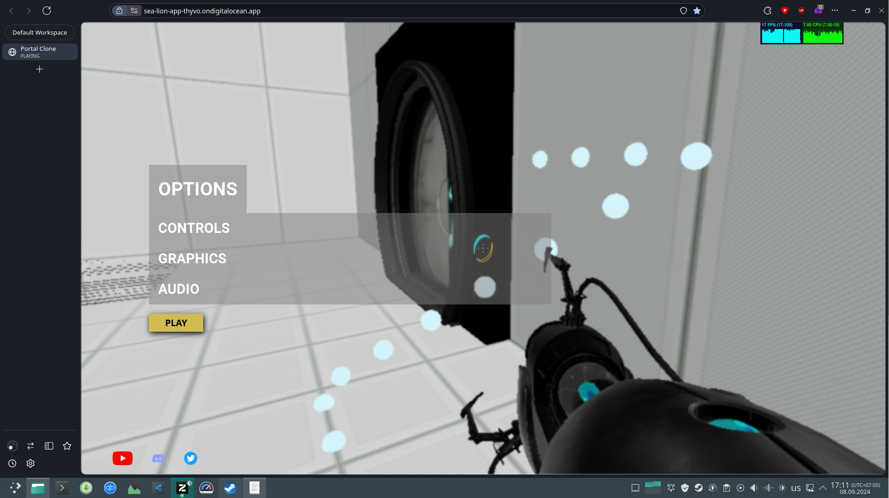
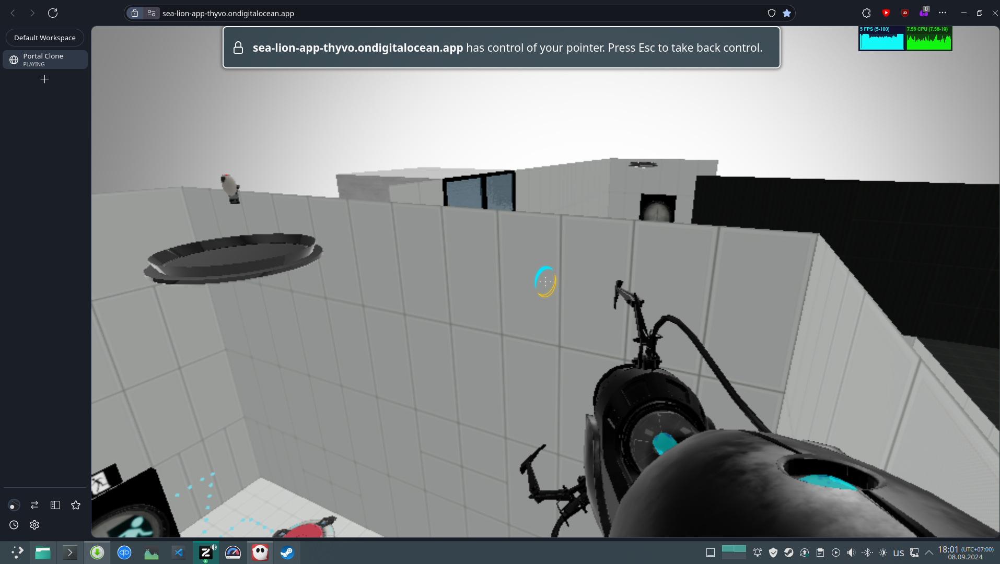
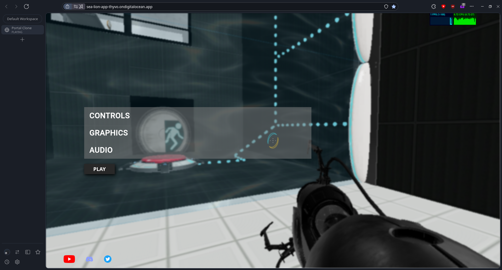
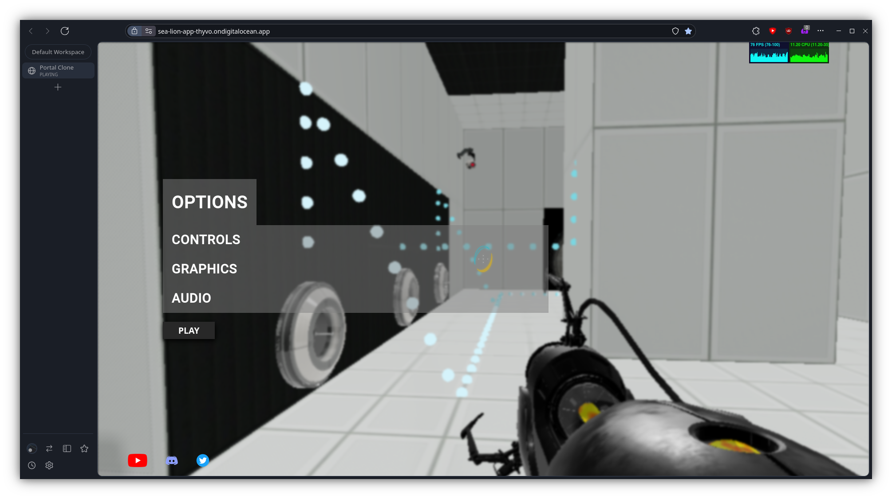
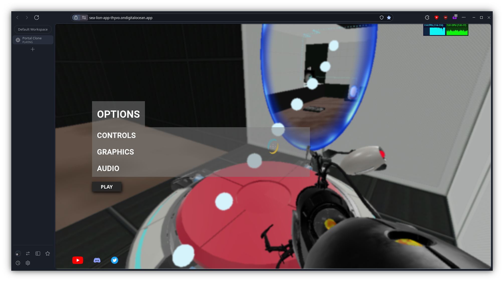
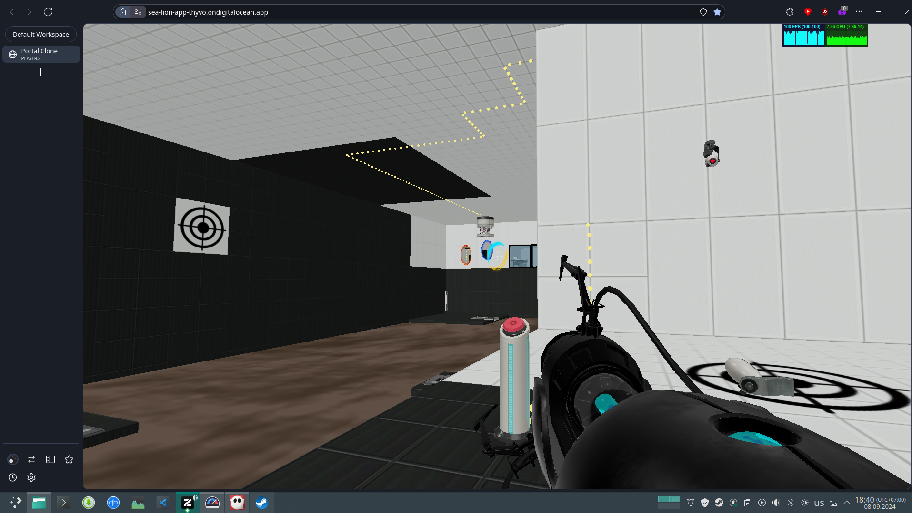
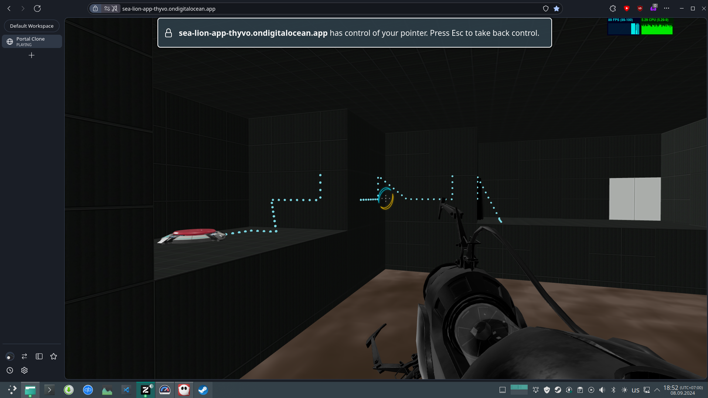
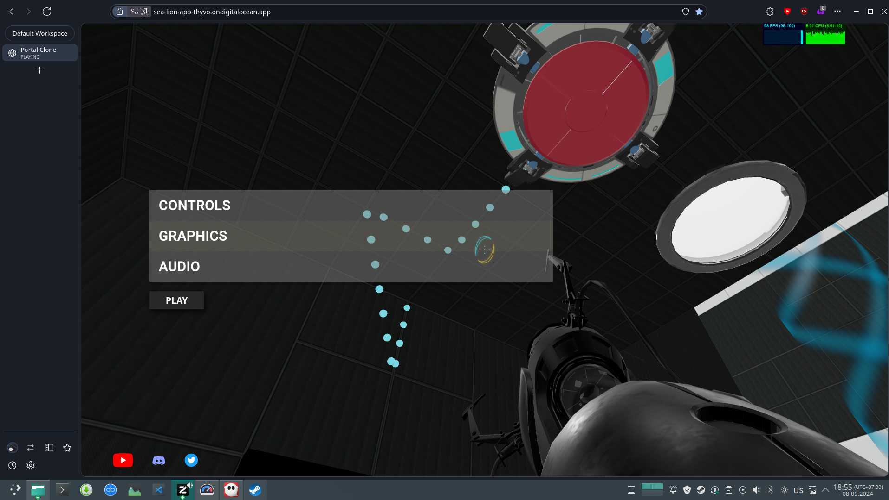
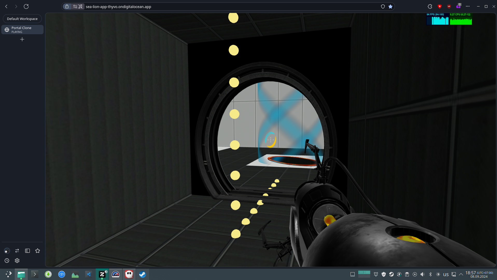
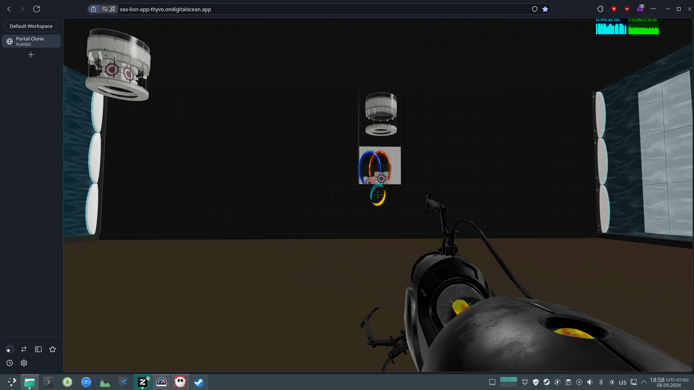

## Specs

OS: Manjaro Linux.

CPU: AMD Ryzen 5 5600H 12 core.

GPU used: Integrated AMD Radeon Graphics (512 MiB VRAM).

I tried to switch it to use Nvidia RTX 3050, but failed in that task.

RAM: 16 GiB


## General

- On firefox-based browsers there is a hotkey "Ctrl + W" that immideately closes the tab. At first i though that game crashes on crouch, but no. I wonder if the tab could override this hotkey.

- By repeatedly jumping on the radio you evenually push it through the floor.

- Back of the elevator only has collision in the upper part. By crouching, you can just climb into and behind the elevator model.

- Open door frames and cube dispensers have no collision.

- While game prevents you from putting a portal under a straight wall, you can still put it under a 90deg corner and fall OOB.

- Console spams error message "Cookie '__cf_bm' has been rejected for invalid domain." for every asset file it loads.

- By jumping with right timings, you can jump ~1.5x higher approx. every other jump. 
	
	Moreover, i accidentally once managed to get a combo of 4 successfull jumps in a row, that made me bang player head into the ceiling (room is 4m tall). But cannot replicate that case
	
	I have no idea, what happens under the hood. But most probable cause, IMHO, is that player after falling gets clipped into the floor a tiny amount. And it takes player a single tick longer to move from out of floor. And in that single tick game makes second "jump", by accelerates player again.

- Camera prop falling OOB crashes the game. This is really easy to do accidentally.

   ```
   Uncaught TypeError: e.name is undefined
    pA https://sea-lion-app-thyvo.ondigitalocean.app/static/js/main.799bc210.js:248
    oT https://sea-lion-app-thyvo.ondigitalocean.app/static/js/main.799bc210.js:230
    hM https://sea-lion-app-thyvo.ondigitalocean.app/static/js/main.799bc210.js:1028
    hM https://sea-lion-app-thyvo.ondigitalocean.app/static/js/main.799bc210.js:1028
    hM https://sea-lion-app-thyvo.ondigitalocean.app/static/js/main.799bc210.js:1028
    hM https://sea-lion-app-thyvo.ondigitalocean.app/static/js/main.799bc210.js:1028  
    ...
   ```

## Level 2

### Room 1

- Falling down the pit wihtout picking the portal gun up is yet another softlock.


- By just spamming LMB for fun, i managed to place an upside-down portal... somewhere. And at a really weird angle. 
	
	This also made me unable to place any more portals, for some reason. Softlock yet again. Here you can see it:

	https://youtu.be/f09nMrNtjLI


- Seems like entering a portal with any significant non-perpendicular part of velocity makes you fall OOB. Just jumping before entering sometimes enough to get out of bounds.
	
	Also, falling OOB erases all portals (after teleporting you back with a death sound). Thats a softlock on levels where you can only place blue portal.
	
	Here is a recording with an easy way to do that:
	https://youtu.be/9XnFthEL0mc

### Room 2

- Model of the portal extends behind the portal.
	https://youtu.be/yjU2s5nUD2U

- Anti-expropriation field, betweel room 2 and room 3 does not destroy cameras. Probably cubes too, but i did not test.

### Room 3

- Third orange portal frame does not turn on sometimes. Idk the reason. Softlock.

- Wire floats in the air.
	

- Clicking, while looking at the anti-expropriation field crashes the game (even if you click through the closed door).

```
Uncaught TypeError: Qv.PORTALS[e].hostObjects is null
    zT https://sea-lion-app-thyvo.ondigitalocean.app/static/js/main.799bc210.js:230
    hM https://sea-lion-app-thyvo.ondigitalocean.app/static/js/main.799bc210.js:1028
    hM https://sea-lion-app-thyvo.ondigitalocean.app/static/js/main.799bc210.js:1028
    hM https://sea-lion-app-thyvo.ondigitalocean.app/static/js/main.799bc210.js:1028
```

- When there is no orange portal for whatever reason, you can place blue portal on the ceiling right above anti-expropriation field. That removes ceiling collision in that place. By then propflying with camera into the ceiling you get above the ceiling level. By then flying through the field with camera you remove blue portal and return collision. This lets you get out of bounds and then propfly to wherever.

	

- Elevator room in the end does not have camera prop collisions. Dropping a camera there crashes the game, since cameras falling OOB cause crash.

## Level 3

### Room 1

- Wire: 

### Room 2

- Lasers generate ABSURD amount of lag.

### Room 3

- Wire: 

- On the first run i spent a lot of time in room 2, trying to activate all laser receivers with one cube. With time, performace was becoming poorer and poorer. Then, when i got to room 3 - lag became even worse, and 30 seconds later, my (quite powerful) laptop started hitting 100% CPU, then a minute of unresponsive game, and entire browser window just crashed.

	I was not doing any recursive lasers BTW. Just one laser ray passing through a cube once and a portal once.

## Level 4

### Room 1

- Ball fell into the toxic water and just stayed there. Did not fissle or respawn. Softlock due to inability to retrieve it.

### Room 2

- Wire: 

- (At this point i discovered that you can enable higher quality graphics). After clicking a button both the button got stuck and the cube did not fall out of dispenser. Softlock.
	

## Level 5

### Room 1

- Wire: 

## Level 6

### Room 1

- Wire: 

- Reaching ceiling in a funnel will get your head stuck in it (crouch to get unstuck).

- These wires are diabolical: 

### Room 2

- Um? 

## Level 7

### Room 1

- You can just grab a cube directly from dispenser. But it will have no gravily applied: https://youtu.be/KlCfBDzAf9s


